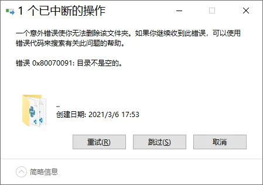

# 【萝莉病毒？】删不掉的..！

事情是这样的——

## 效果

你可以试着把这个仓库里的`萝莉.exe`下回去运行一下，它会在文件夹里创建一个看起来是`..`的文件夹。

但其实不是，这个文件夹的名字是`.. `——唔，它似乎一点也不稀奇！

不过，它的神奇之处在于，如果你进入这个文件夹，看到的却不是一个真正的文件夹，而是刚才那个文件夹的所有内容！甚至这个文件夹里还有一个`.. `！

而且如果用一般的方法删除它，就会——

## 为什么会这样？

根据我的猜测，应该是: 

windows的文件夹名有两个规则。一个是不能以空格结尾，`mkdir`会自动帮我把结尾的空格去掉，另外一个是不能以`/`结尾，它也会自动帮我去掉`/`。

但是它们是有顺序的。

我建的文件夹名其实是`./.. /`，所以能根据顺序来绕过第一个规则。然后前端访问这个文件夹的时候，文件夹里的空格又被去掉了，导致它访问不到真正的文件夹。

话说这个bug我上高中的时候就发现了居然现在还没修复，微软员工真是太懒了，你们要努力工作啊！

## 用法

没什么用，也许可以吓唬一下女生？
